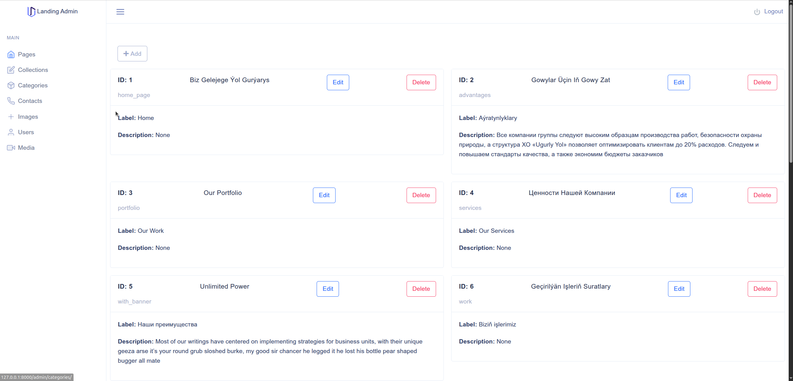
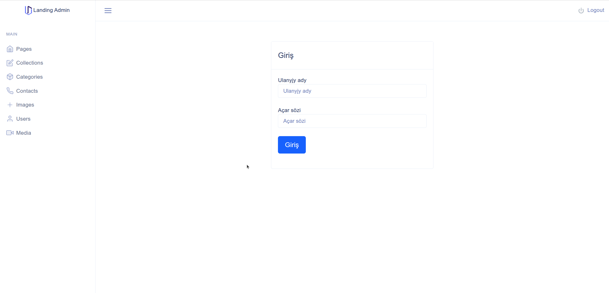
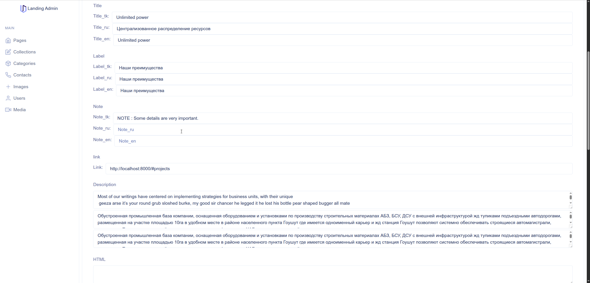
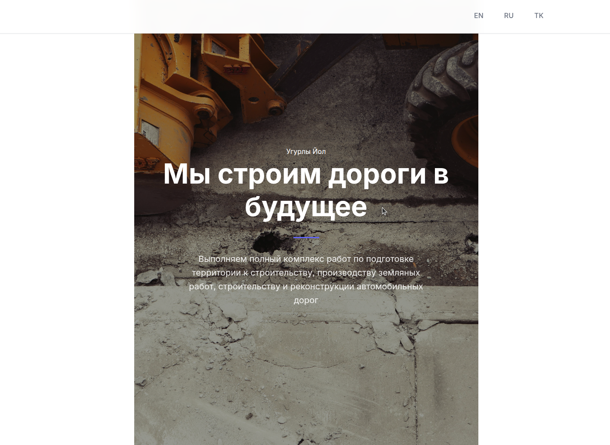
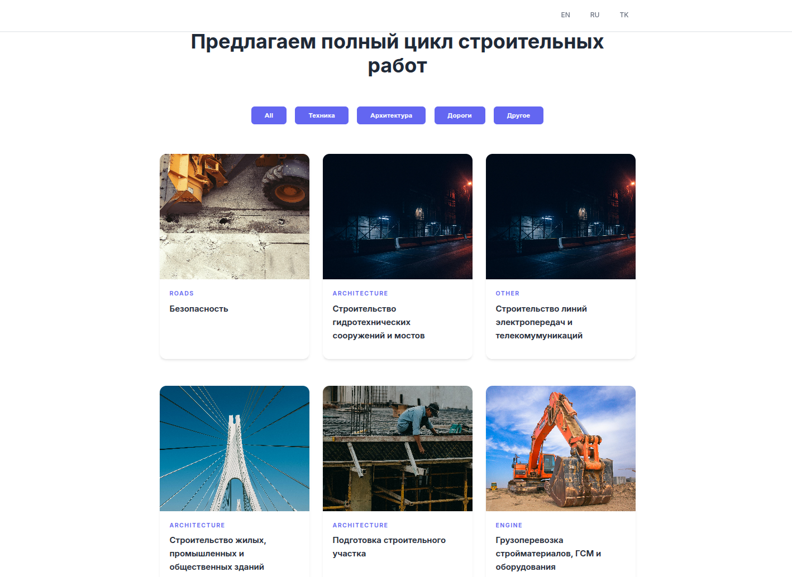
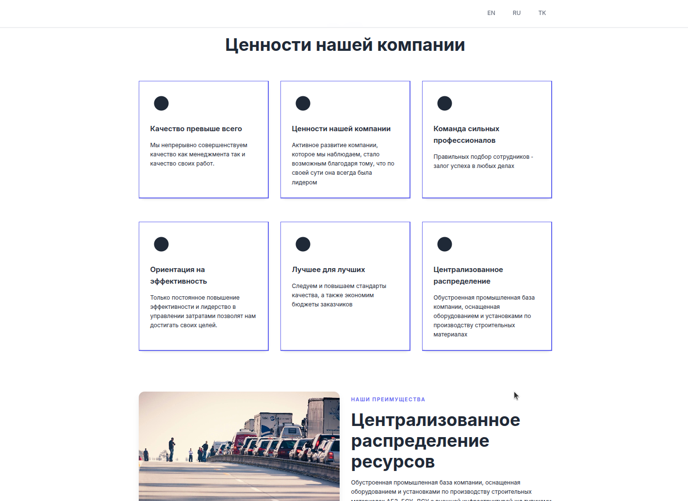
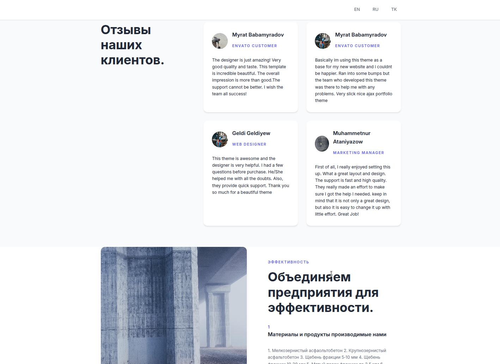
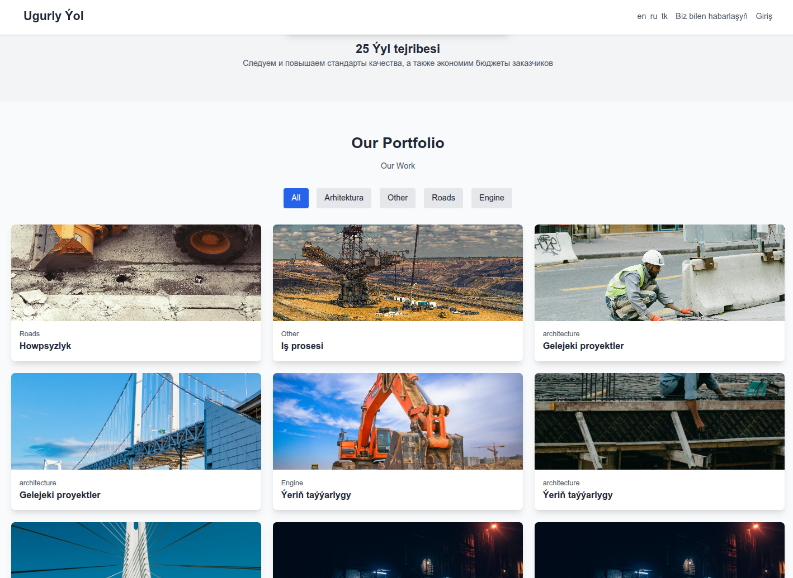

# Landing Admin

A Python Flask web application with admin panel, REST API, and multi-language support for managing landing pages.
 

| | |
|----|---|
|||
|||
|||
|||


## Features

- **Admin Panel**: Web-based administration interface
- **REST API**: Full API endpoints for frontend integration
- **Multi-language Support**: Supports Turkmen (tk), English (en), and Russian (ru)
- **Caching**: Redis-based caching for improved performance
- **Session Management**: Redis session storage
- **Database Support**: PostgreSQL and MSSQL support
- **Security**: CSRF protection, user authentication
- **Performance**: HTML minification, compression, CORS support

---

```
! If images are local, change url to:
"file_path": "/static/web/assets/img/ugurly_yol/worker1.png"
```

## Quick Start with Docker

The fastest way to get started:

```bash
# Clone the repository
git clone git@github.com:mikebionic/landing_admin.git
cd landing-admin

# Copy environment file
cp .env.example .env

# Edit .env with your settings (optional - defaults work for development)
nano .env

# Start the application
make docker-up
```

The application will be available at `http://localhost:8000`

---

## Manual Setup

### Prerequisites

- Python 3.8+
- PostgreSQL 12+
- Redis (optional, but recommended)

### Installation Steps

1. **Clone and setup**
   ```bash
   git clone <your-repo-url>
   cd landing-admin
   python -m venv venv
   source venv/bin/activate  # On Windows: venv\Scripts\activate
   pip install -r requirements.txt
   ```

2. **Database Setup**
   ```bash
   # Create PostgreSQL database
   createdb landing_admin
   
   # Or connect to PostgreSQL and run:
   # CREATE DATABASE landing_admin;
   ```

3. **Configuration**
   ```bash
   cp .env.example .env
   # Edit .env with your database credentials and other settings
   ```

4. **Create required directories**
   ```bash
   mkdir -p static/uploads
   ```

5. **Database Migration**
   ```bash
   # Copy migration config
   cp example.migration.json app.migration.json
   # Edit app.migration.json as needed
   
   # Run migrations (if available)
   flask db upgrade
   ```

6. **Run the application**
   ```bash
   python app.py
   ```

---

## Environment Configuration

Key environment variables in `.env`:

### Application Settings
- `APP_PORT`: Port to run the application (default: 8000)
- `APP_HOST`: Host address (default: 0.0.0.0)
- `SECRET_KEY`: Flask secret key for sessions
- `DEBUG`: Enable debug mode (1/0)

### Database Configuration
- `DB_TYPE`: Database type (postgres/mssql)
- `DB_USERNAME`: Database username
- `DB_PASSWORD`: Database password
- `DB_DATABASE`: Database name
- `DB_HOST`: Database host
- `DB_PORT`: Database port

### Redis Configuration (Optional)
- `SESSION_REDIS`: Redis URL for sessions
- `CACHE_REDIS_URL`: Redis URL for caching
- `CACHE_TYPE`: Cache type (simple/redis)

### Features
- `USE_FLASK_CORS`: Enable CORS (1/0)
- `USE_FLASK_COMPRESS`: Enable compression (1/0)
- `BABEL_DEFAULT_LOCALE`: Default language (tk/en/ru)

---

## Available Commands (Makefile)

```bash
# Development
make install          # Install dependencies
make run             # Run development server
make test            # Run tests (if available)

# Docker operations
make docker-build    # Build Docker image
make docker-up       # Start with docker-compose
make docker-down     # Stop docker-compose
make docker-logs     # View logs
make docker-shell    # Access container shell

# Database operations
make db-init         # Initialize database
make db-migrate      # Run migrations
make db-reset        # Reset database

# Utilities
make clean           # Clean temporary files
make lint            # Run code linting
make format          # Format code
```

---

## API Endpoints

The application provides REST API endpoints under `/api` prefix:
- `GET /api/auth/get-images/` - Get Images'
- `GET /api/auth/get-pages/` - Get Pages'


### Admin Routes
- Admin panel available at `/admin/login`
- Web interface at `/`

### Language Support
- Switch language: `GET /set_language/<code>`
- Supported codes: `tk`, `en`, `ru`

---

## Project Structure

```
landing-admin/
├── app.py                 # Application entry point
├── main/
│   ├── __init__.py       # App factory and configuration
│   ├── config.py         # Configuration settings
│   ├── models.py         # Database models
│   ├── languageMethods.py # Language utilities
│   ├── admin/            # Admin blueprint
│   ├── web/              # Web blueprint  
│   ├── api/              # API blueprint
│   ├── static/           # Static files
│   └── templates/        # Jinja2 templates
├── static/
│   └── uploads/          # Upload directory
├── requirements.txt      # Python dependencies
├── Dockerfile           # Docker configuration
├── docker-compose.yml   # Docker Compose setup
├── Makefile            # Development commands
└── .env                # Environment variables
```

---

## Development

### Adding New Features

1. **Models**: Add database models in `main/models.py`
2. **Routes**: Create routes in appropriate blueprint (`admin`, `web`, `api`)
3. **Templates**: Add Jinja2 templates in `main/templates`
4. **Static Files**: Add CSS/JS/images in `main/static`

### Multi-language Support

The application uses Flask-Babel for internationalization:

1. **Mark strings for translation**:
   ```python
   from flask_babel import gettext, lazy_gettext
   message = gettext('Hello World')
   ```

2. **Extract messages**:
   ```bash
   pybabel extract -F babel.cfg -k _l -o messages.pot .
   ```

3. **Update translations**:
   ```bash
   pybabel update -i messages.pot -d translations
   ```

### Database Operations

Use SQLAlchemy for database operations:

```python
from main import db
from main.models import YourModel

# Create
item = YourModel(name='example')
db.session.add(item)
db.session.commit()

# Query
items = YourModel.query.all()
```

---

## Deployment

### Production Deployment

1. **Using Docker** (Recommended):
   ```bash
   # Production build
   docker-compose -f docker-compose.prod.yml up -d
   ```

2. **Manual Deployment**:
   ```bash
   # Use a production WSGI server
   pip install gunicorn
   gunicorn -w 4 -b 0.0.0.0:8000 app:app
   ```

### Environment Variables for Production

Set these additional variables for production:

```bash
DEBUG=0
TESTING=0
SECRET_KEY=your-super-secret-key
FLASK_ENV=production
```

---

## Troubleshooting

### Common Issues

1. **Database Connection Error**:
   - Check database credentials in `.env`
   - Ensure PostgreSQL is running
   - Verify database exists

2. **Redis Connection Error**:
   - Install and start Redis server
   - Or set `SESSION_TYPE=filesystem` in `.env`

3. **Permission Errors**:
   - Ensure `static/uploads` directory exists
   - Check file permissions

4. **Import Errors**:
   - Activate virtual environment
   - Install requirements: `pip install -r requirements.txt`

### Logs

View application logs:
```bash
# Docker
make docker-logs

# Manual
tail -f app.log
```

---

## Contributing

1. Fork the repository
2. Create a feature branch: `git checkout -b feature-name`
3. Make changes and test
4. Commit: `git commit -am 'Add feature'`
5. Push: `git push origin feature-name`
6. Create Pull Request

---

## License

This project is licensed under the MIT License - see the LICENSE file for details.

## Use Cases

This project is perfect for:

- **Landing Pages**: Create database-driven landing pages with admin control
- **Multi-language Websites**: Built-in support for Turkmen, English, and Russian
- **Content Management**: Administrators can update content without code changes
- **API-driven Frontends**: REST API for modern frontend frameworks
- **Small Business Websites**: Simple admin panel for non-technical users

**Legacy Notice**: This project was created in 2021 and uses some older dependencies. While fully functional, consider upgrading packages for production use. It serves as an excellent reference or starting point for similar projects.

---

## Support

For support and questions:
- Create an issue on GitHub
- Check the troubleshooting section
- Review environment configuration

**Good luck in development!** 🚀

---